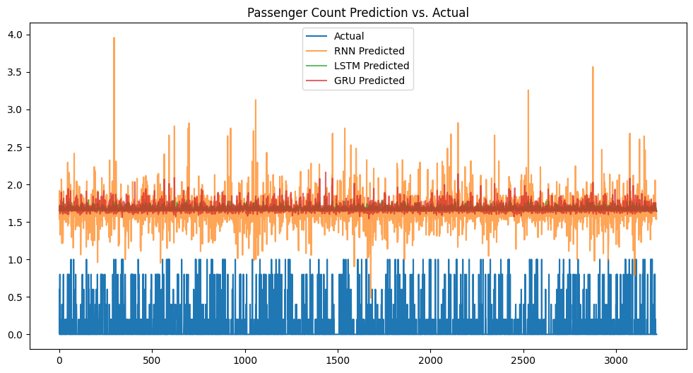

# NYC Taxi Trip Prediction using RNN, LSTM, and GRU

This project focuses on predicting taxi trip patterns—specifically pickups and drop-offs—using deep learning models like RNN, LSTM, and GRU. The analysis is based on the New York City Taxi dataset and aims to compare model performance in time series forecasting.

## 📷 Sample Visualization
- Predicted vs Actual plots

## 📁 Dataset
- **Features**: Pickup datetime, dropoff datetime, trip duration, passenger count, location info, etc.
- **Size**: Millions of records (used a sample for modeling)

## 🧠 Models Used
- Recurrent Neural Network (RNN)
- Long Short-Term Memory (LSTM)
- Gated Recurrent Unit (GRU)

## 🛠️ Steps Followed
1. Data Cleaning and Preprocessing
2. Feature Engineering (datetime parsing, resampling)
3. Normalization and Sequencing
4. Model Building and Training
5. Performance Evaluation (RMSE, MAE, etc.)
6. Visualization of Predictions vs Actuals

## 📊 Objective
To evaluate how well different deep learning models handle time series forecasting of taxi trips and compare their accuracy and generalization capabilities.

## 📌 Key Findings
- LSTM generally performed better than RNN and GRU for longer sequences.
- GRU offered a good trade-off between performance and training time.
- Proper time-based feature engineering significantly improved results.

## 🛠️ Tech Stack
- Python
- Pandas, NumPy
- Matplotlib, Seaborn
- TensorFlow / Keras

